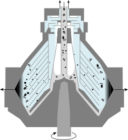
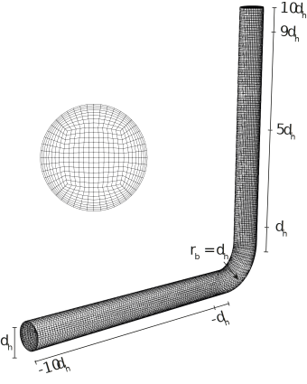
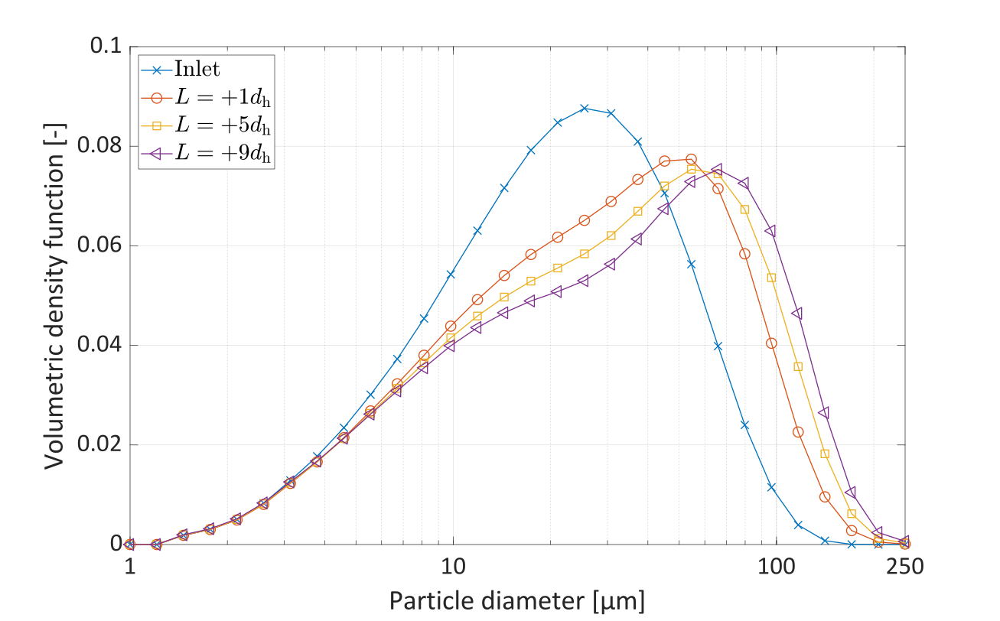

<style>
img[alt~="center"] {
  display: block;
  margin: 0 auto;
}
</style>
# Particle aggregation and breakage using `multiphaseEulerFoam`
A CFD-PBM approach
Kasper Bilde

---

# Introduction


Kasper Bilde
Industrial PhD Student
Aalborg University and Alfa Laval
**Supervisors**: Kim Sørensen and Jakob Hærvig

**PhD Scope**: Aggregation and breakage of micron-sized particles in turbulent flows for highly accelerated sedimentation onboard marine vessels

---
# Background

Marine scrubbers clean the exhaust gas from the engine for SOx and ~40% of the particulate mass.
The particulate matter needs to be removed before discharged into the Oceans.

---
# Motivation

High-speed separators are utilised for an accelerated sedimentation.
The particle size is the most important parameter for sedimentation.

<!-- Space is limited onboard the vessel. Settling tanks cannot be used due to large space and poor efficiency during rough sea. -->
---
# Motivation
Micron-sized particles are agglomerated in a hydraulic flocculator before separation in the high-speed separator.


<!-- Water cleaning system must be compact. -->
<!-- Particles are agglomerated in a static flocculator consisting of a series of pipe bends. -->

---

# Computational domain

Designing a compact hydraulic flocculator and achieving the largest possible particle size distribution.

Analyse the particle size distribution through a 90° pipe bend.
<!-- As the particle size is the most dominating factor in terms of separation efficiency, how can larger particles be produced while maintaining a compact formfactor of the flocculator? -->
---
# Governing equations
Euler-Euler approach using the population balance equations to track the particle size distribution

Mass- and momentum equations
$$
\frac{\partial}{\partial t} \left(\alpha_\varphi \rho_\varphi \right) +
\nabla \cdot \left( \alpha_\varphi \rho_\varphi \boldsymbol{u}_\varphi\right) =0
$$

$$
\frac{\partial}{\partial t}\left(\alpha_\varphi \rho_\varphi \boldsymbol{u}_\varphi\right)
+ \nabla \cdot \left( \alpha_\varphi \rho_\varphi \boldsymbol{u}_\varphi\boldsymbol{u}_\varphi\right)
-\nabla \tau_\varphi = -\alpha_\varphi \nabla p +  \alpha_\varphi\rho_\varphi\boldsymbol{g} + \boldsymbol{M}_\varphi + \boldsymbol{S}_\varphi
$$

where $\boldsymbol{M}_\varphi$ is the momentum exchange at the interfaces and $\boldsymbol{S}_\varphi$ is the source term.
<!-- Phases share same pressure. -->
<!-- Stress tensor can include particle collision model (kinetic theory of granular flows) for disperse phase -->

---
# Governing equations
Momentum exchange at the interfaces is the sum of external force
$$
\boldsymbol{M}_\varphi = \sum_{\varphi=0,\varphi\neq\psi}^{N}\left( \underbrace{F_{D,\varphi,\psi}}_{\text{Wen-Yu drag}}+\underbrace{F_{L,\varphi,\psi}}_{\text{Saffman-Mei lift}}+\underbrace{F_{TD\varphi,\psi}}_{\text{Turbulent dispersion}}+\underbrace{F_{VM,\varphi,\psi}}_{\text{Virtual mass}}\right)
$$

*Saffman-Mei lift force* <a href="https://github.com/OpenFOAM/OpenFOAM-dev/commit/b4bcb29d6a8d8cc0b7576934ece1f0fafaddfccc" target="_blank">*comitted*</a> *to `OpenFOAM-dev`*

---
# Population balance equation
The population balance equation,
$$
\frac{\partial}{\partial t} n_v+\nabla\cdot\left(\boldsymbol{u}_\mathrm{p}n_v \right) = S_v\,,
$$
tracks the number density function. The PBE is solved by the class method which was implemented into `multiphaseEulerFoam` by <a href="https://doi.org/10.1002/aic.17539" target="_blank">Lehnigk et al. (2021)</a>.
Discontinuous changes due to aggregation and breakage are accounted for by the source term, $S_v$.

<!-- Class method needs knowledge about the size range. -->
<!-- Population balance equation solved for each size class -->
<!-- Computational expensive, but provides direct knowledge about the shape of the particle size distribution -->
<!-- This also makes this method quite intuitive compared to other methods. Personal view. -->
---
# Aggregation kernel
The aggregation kernel for solid particles by <a href="https://doi.org/10.1006/JCIS.1994.1234" target="_blank">Adachi et al. (1994)</a> is <a href="https://github.com/OpenFOAM/OpenFOAM-dev/commit/b4bcb29d6a8d8cc0b7576934ece1f0fafaddfccc" target="_blank">implemented</a> into `OpenFOAM-dev`.
$$
a_{d,d^\prime} = \frac{4}{3}\sqrt{\frac{3\pi}{10}}\sqrt{\frac{\varepsilon}{\nu}}\left(d+d^\prime\right)^3
$$

where $d$ and $d^\prime$ are the diameters of two colliding particles.

---
# Breakage kernel
The breakage kernel for solid particles by <a href="https://doi.org/10.6100/IR362582" target="_blank">Kusters (1991)</a> is <a href="https://github.com/OpenFOAM/OpenFOAM-dev/commit/b4bcb29d6a8d8cc0b7576934ece1f0fafaddfccc" target="_blank">implemented</a> into `OpenFOAM-dev`.

$$
b_{v^\prime} = \sqrt{\frac{4}{15\pi}}\sqrt{\frac{\varepsilon}{\nu}}\exp\left(-\frac{\varepsilon_\mathrm{cr}}{\varepsilon}\right)
$$
Herein the critical energy dissipation rate required to cause a break up is given by
$$
\varepsilon_\mathrm{cr} =\frac{B}{r_\mathrm{c}}\,,
$$
where $B$ is the particle strength parameter and $r_\mathrm{c}$ is the collision radius of a particle.
<!-- Same factor driving both aggregation and breakage. -->
---
# Simulation properties


---
# Results
 

---
# Particle size distribution


---
# Development work
<video controls width=100%>
    <source src="visuals/developmentwork.mp4"
            type="video/mp4">
</video>

---
# Closing remarks
The CFD-PBE framework allows to directly analyse the particle size distribution within the domain.

It is visible how the particles aggregate in the straight turbulent pipe and break up when subject to the sharp curvature of the bend.

On-going work is made to determine the best suited desing for marine installation for effective accelerated sedimentation.

Optimising the flocculation system allows for less pollutants discharged to the Oceans.

---

# Source files
The presented 90° pipe bend is <a href="https://github.com/OpenFOAM/OpenFOAM-dev/commit/0999cd0efea8811f6d98c631f5ff3a53f6efb2d9" target="_blank">comitted</a> to `OpenFOAM-dev` of OpenFOAM Foundation.

The tutorial is located under the `multiphaseEulerFoam` tutorials.
```
$FOAM_TUTORIALS/multiphase/multiphaseEulerFoam/RAS/pipeBend
```
The Saffman-Mei lift force model, the aggregation kernel and the breakage kernel are also <a href="https://github.com/OpenFOAM/OpenFOAM-dev/commit/b4bcb29d6a8d8cc0b7576934ece1f0fafaddfccc" target="_blank">comitted</a> to `OpenFOAM-dev`.


---
# Acknowledgements
A big thank you to Dr. Ronald Lehnigk and Dr. Fabian Schlegel from Helmholtz-Zentrum Dresden Rossendorf as well as Anders Schou Simonsen from Alfa Laval for their assistance in the development of this work.

---
# Thank you for your attention.

If you have any question, feel free to ask or reach out.

Email: kaspergram.bilde@alfalaval.com

Presentation is available at GitHub.

**Socials**
<a href="https://www.linkedin.com/in/kasper-gram-bilde/" target="_blank"></a>
<a href="https://github.com/kasperbilde/openfoam-workshop" target="_blank"></a>

---
# References
1. Adachi, Y., Cohen Stuart, M. A., & Fokkink, R. (1994). Kinetics of Turbulent Coagulation Studied by Means of End-over-End Rotation. Journal of Colloid and Interface Science, 165(2), 310–317. https://doi.org/10.1006/JCIS.1994.1234
1. Kusters, K. A. (1991). The influence of turbulence on aggregation of small particles in agitated vessels [Technische Universiteit Eindhoven]. https://doi.org/10.6100/IR362582
1. Lehnigk, R., Bainbridge, W., Liao, Y., Lucas, D., Niemi, T., Peltola, J., & Schlegel, F. (2021). An open-source population balance modeling framework for the simulation of polydisperse multiphase flows. AIChE Journal, e17539. https://doi.org/10.1002/AIC.17539
1. Simonsen, A. S. (2018). Modelling and Analysis of Seawater Scrubbers for Reducing SOx Emissions from Marine Engines. Aalborg Universitetsforlag.
